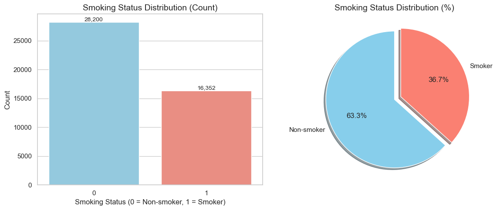
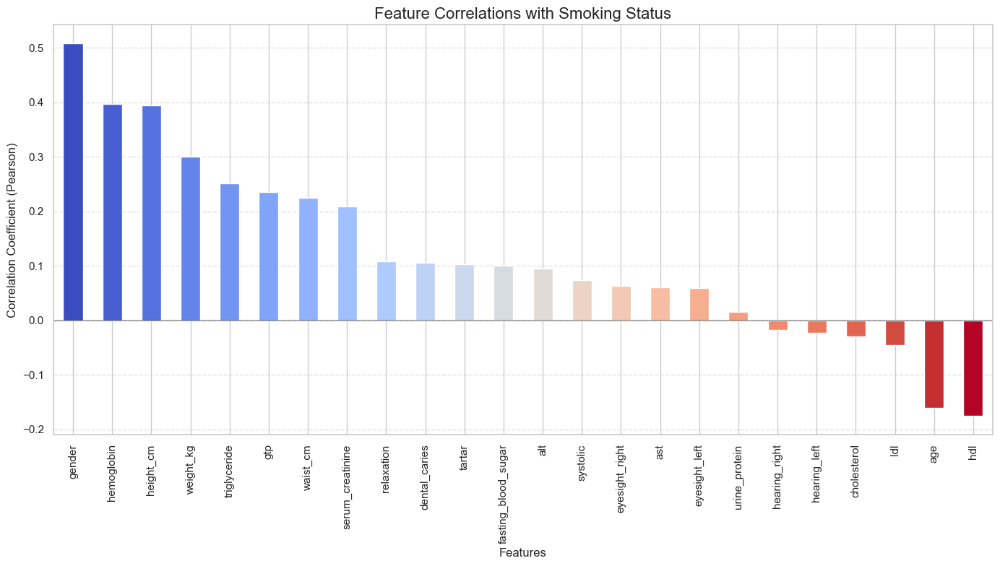
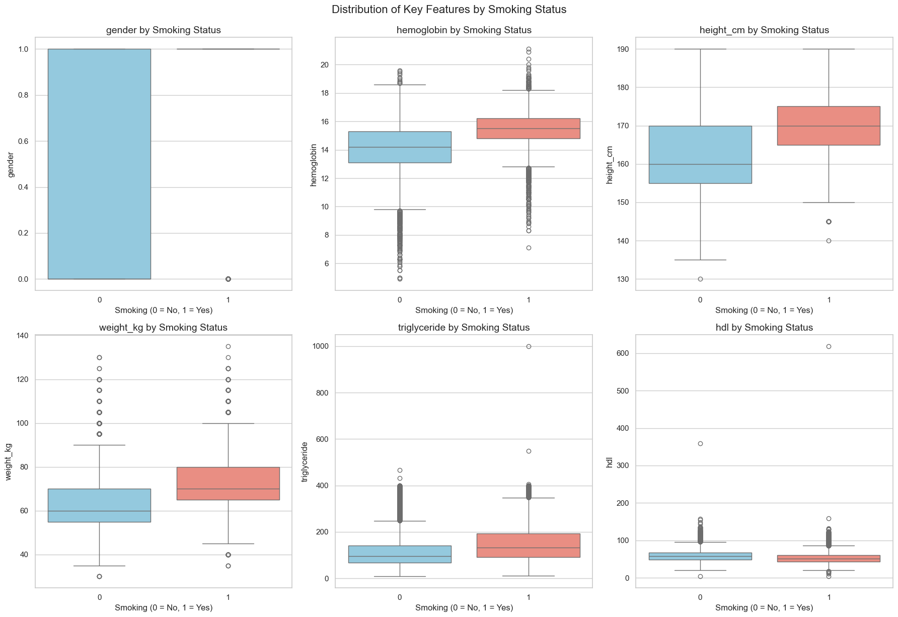
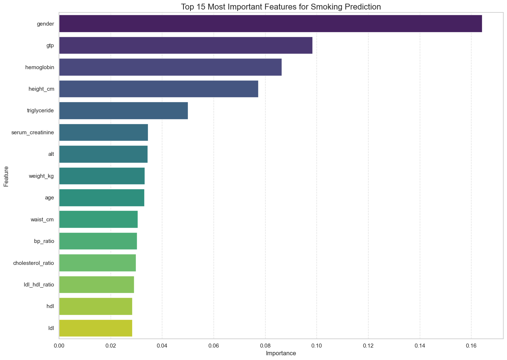
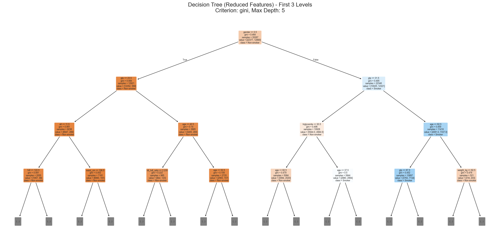
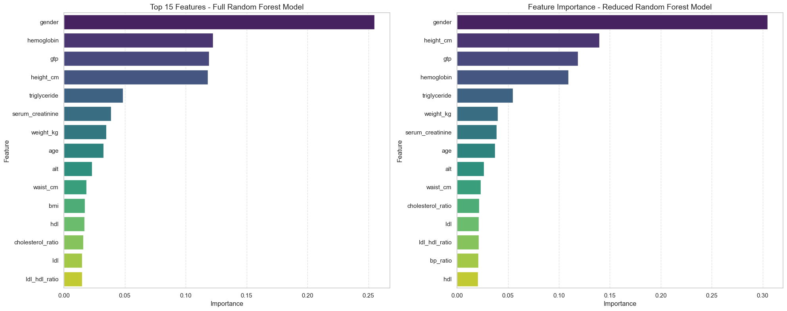
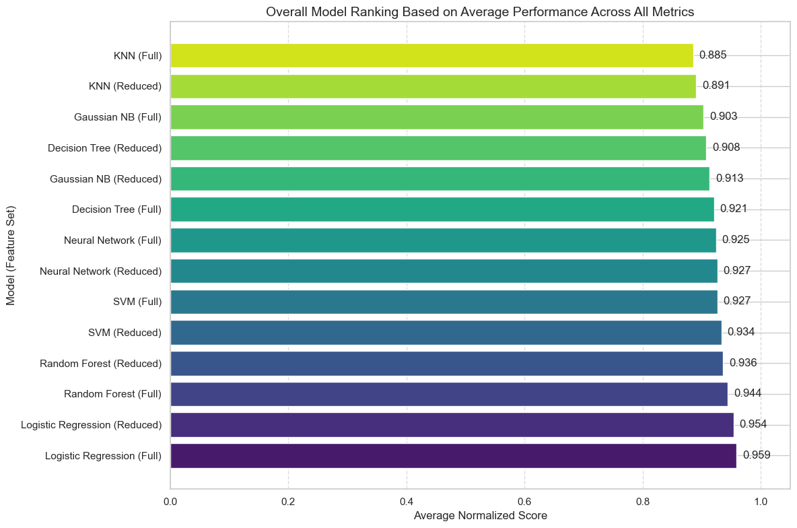
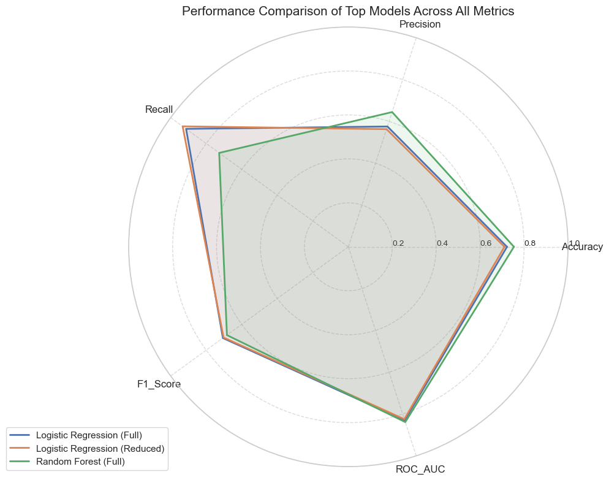

# ML Classifiers Comparison: Smoking Status Prediction

This project is a comparative study of 7 machine learning classification algorithms for predicting smoking status using health indicators. We evaluated model performance across full (30 features) and reduced (16 features) datasets derived from the Kaggle Body Signal of Smoking dataset.

## Table of Contents

1. [Dataset](#dataset)
2. [Data Preprocessing and EDA](#data-preprocessing-and-eda)
3. [Classification Models](#classification-models)
   - [K-Nearest Neighbors (KNN)](#k-nearest-neighbors-knn)
   - [Decision Tree (CART)](#decision-tree-cart)
   - [Random Forest](#random-forest)
   - [Support Vector Machine (SVM)](#support-vector-machine-svm)
   - [Naive Bayes](#naive-bayes)
   - [Logistic Regression](#logistic-regression)
   - [Neural Network](#neural-network)
4. [Model Comparison](#model-comparison)
5. [Results Summary](#results-summary)
6. [Tech Stack](#tech-stack)
7. [Installation and Usage](#installation-and-usage)
8. [Academic Context](#academic-context)
9. [References](#references)

## Dataset

**Source:** [Body Signal of Smoking - Kaggle](https://www.kaggle.com/datasets/kukuroo3/body-signal-of-smoking/data)

The dataset contains health screening data collected from various health examination centers. Each record represents an individual's biological signals and health indicators, with a binary target variable indicating smoking status. We used this dataset to train and evaluate our classification models.

### Dataset Statistics

| Metric                     | Value  |
| -------------------------- | ------ |
| Original Records           | 55,692 |
| Records After Cleaning     | 44,084 |
| Original Features          | 27     |
| Features After Engineering | 30     |
| Reduced Feature Set        | 16     |

### Class Distribution (Final Dataset)

| Class          | Count  | Percentage |
| -------------- | ------ | ---------- |
| Non-Smoker (0) | 27,972 | 63.4%      |
| Smoker (1)     | 16,112 | 36.6%      |

_Total: 44,084 records after duplicate removal and outlier cleaning_

### Feature Categories

| Category      | Features                                                      |
| ------------- | ------------------------------------------------------------- |
| Demographics  | gender, age, height_cm, weight_kg, waist_cm                   |
| Vital Signs   | systolic, relaxation (diastolic), fasting_blood_sugar         |
| Blood Lipids  | cholesterol, hdl, ldl, triglyceride                           |
| Blood Tests   | hemoglobin, urine_protein, serum_creatinine                   |
| Liver Enzymes | ast, alt, gtp                                                 |
| Sensory       | eyesight_left, eyesight_right, hearing_left, hearing_right    |
| Dental        | dental_caries, tartar                                         |
| Engineered    | bmi, bp_ratio, cholesterol_ratio, ldl_hdl_ratio, hypertension |

## Data Preprocessing and EDA

### Data Cleaning Steps

1. **Column Renaming:** Converted all column names to snake_case format for consistency
2. **Categorical Encoding:** Encoded categorical variables:
   - Gender: F → 0, M → 1
   - Tartar: N → 0, Y → 1
   - Hearing: Standardized to 1 (normal), 2 (abnormal)
3. **Duplicate Removal:** Removed 11,140 duplicate records (20.0% of original data)
4. **Outlier Detection:** Applied the IQR method across all numerical features
5. **Outlier Removal:** Removed 468 records appearing as outliers in 5+ columns (1.05% of cleaned data)
6. **Feature Removal:** Dropped the 'ID' column and 'oral' column (constant value)

### Feature Engineering

We created five new features based on domain knowledge:

| Feature           | Formula                                  | Correlation with Smoking |
| ----------------- | ---------------------------------------- | ------------------------ |
| bmi               | weight_kg / (height_cm/100)^2            | 0.104                    |
| bp_ratio          | systolic / relaxation                    | -0.061                   |
| cholesterol_ratio | cholesterol / hdl                        | 0.145                    |
| ldl_hdl_ratio     | ldl / hdl                                | 0.071                    |
| hypertension      | 1 if systolic >= 140 OR relaxation >= 90 | 0.010                    |

### Feature Selection

We used Random Forest with 100 estimators to rank feature importance and selected the top 15 features for the reduced dataset:

1. gender
2. gtp
3. hemoglobin
4. height_cm
5. triglyceride
6. serum_creatinine
7. alt
8. weight_kg
9. age
10. waist_cm
11. bp_ratio
12. cholesterol_ratio
13. ldl_hdl_ratio
14. hdl
15. ldl

### Key Correlations with Smoking Status

| Feature      | Correlation |
| ------------ | ----------- |
| gender       | 0.508       |
| hemoglobin   | 0.397       |
| height_cm    | 0.394       |
| triglyceride | 0.251       |
| gtp          | 0.210       |

### Visualizations

<p align="center"><strong>Figure 1: Class Distribution</strong></p>
<p align="center"></p>
<p align="center"><em>Target variable distribution after duplicate removal (before outlier removal): 28,200 non-smokers vs 16,352 smokers. Final counts after all cleaning: 27,972 vs 16,112.</em></p>

<p align="center"><strong>Figure 2: Feature Correlations with Smoking Status</strong></p>
<p align="center"></p>
<p align="center"><em>Pearson correlation coefficients between each feature and smoking status, sorted by strength</em></p>

<p align="center"><strong>Figure 3: Feature Distributions by Smoking Status</strong></p>
<p align="center"></p>
<p align="center"><em>Box plots comparing distributions of top correlated features (gender, hemoglobin, height, weight, triglyceride, HDL) between smokers and non-smokers</em></p>

<p align="center"><strong>Figure 4: Feature Importance for Smoking Prediction</strong></p>
<p align="center"></p>
<p align="center"><em>Random Forest feature importance ranking used to select top 15 features for the reduced dataset</em></p>

## Classification Models

We trained all models on an 80/20 train-test split with stratified sampling to maintain class proportions. We evaluated each model on both the full feature set (30 features) and reduced feature set (16 features).

### K-Nearest Neighbors (KNN)

KNN is a distance-based classifier that assigns class labels based on the majority vote of k nearest training samples.

**Hyperparameters:**

- n_neighbors: 19 (optimized via 5-fold cross-validation, testing k=1 to 20)
- Scaling: MinMaxScaler

| Metric    | Full Features | Reduced Features |
| --------- | ------------- | ---------------- |
| Accuracy  | 72.42%        | 72.56%           |
| Precision | 62.00%        | 61.88%           |
| Recall    | 63.35%        | 64.93%           |
| F1 Score  | 0.6267        | 0.6337           |
| ROC-AUC   | 0.8075        | 0.8071           |

**Observation:** Minimal difference between feature sets. Reduced features performed marginally better on accuracy and recall.

### Decision Tree (CART)

CART (Classification and Regression Tree) recursively partitions the feature space using binary splits.

**Hyperparameters:**

- criterion: gini
- max_depth: 5 (optimized from [5, 10, 15, 20, 25, 30, None])
- random_state: 1

| Metric    | Full Features | Reduced Features |
| --------- | ------------- | ---------------- |
| Accuracy  | 73.64%        | 73.44%           |
| Precision | 61.97%        | 62.61%           |
| Recall    | 72.16%        | 67.82%           |
| F1 Score  | 0.6668        | 0.6511           |
| ROC-AUC   | 0.8153        | 0.8144           |

**Observation:** Full features achieved higher recall (72.16% vs 67.82%). Shallow tree depth (5) prevents overfitting.

<p align="center"><strong>Figure 5: Decision Tree Structure (Reduced Features)</strong></p>
<p align="center"></p>
<p align="center"><em>First 3 levels of the decision tree trained on reduced features, showing split criteria (gini), sample counts, and class predictions at each node</em></p>

### Random Forest

Ensemble method that aggregates predictions from multiple decision trees trained on bootstrap samples.

**Hyperparameters:**

- n_estimators: 200 (optimized from [10, 50, 100, 150, 200])
- max_depth: 10 (optimized from [5, 10, 15, 20, 25, 30, None])

| Metric    | Full Features | Reduced Features |
| --------- | ------------- | ---------------- |
| Accuracy  | 75.38%        | 74.89%           |
| Precision | 64.46%        | 63.93%           |
| Recall    | 72.69%        | 71.79%           |
| F1 Score  | 0.6833        | 0.6763           |
| ROC-AUC   | 0.8385        | 0.8345           |

**Observation:** Highest accuracy (75.38%) and ROC-AUC (0.8385) among all models. Reduced features maintained 99.5% of full feature performance.

<p align="center"><strong>Figure 6: Random Forest Feature Importance</strong></p>
<p align="center"></p>
<p align="center"><em>Feature importance comparison between full model (left, 15 features shown) and reduced model (right, all 15 features). Gender dominates in both, followed by hemoglobin, gtp, and height.</em></p>

### Support Vector Machine (SVM)

Maximum margin classifier that finds the optimal hyperplane separating classes in feature space.

**Hyperparameters:**

- kernel: RBF (Radial Basis Function)
- Scaling: MinMaxScaler

| Metric    | Full Features | Reduced Features |
| --------- | ------------- | ---------------- |
| Accuracy  | 73.80%        | 74.35%           |
| Precision | 61.85%        | 62.42%           |
| Recall    | 73.87%        | 74.89%           |
| F1 Score  | 0.6733        | 0.6809           |
| ROC-AUC   | 0.8171        | 0.8150           |

**Observation:** Reduced features outperformed full features on accuracy and recall. SVM benefits from dimensionality reduction.

### Naive Bayes

Probabilistic classifier based on Bayes theorem with strong independence assumptions between features.

**Variant Selection:**

We tested Gaussian NB, Bernoulli NB, Multinomial NB, and Complement NB. Gaussian NB gave the highest accuracy so we used that.

| Metric    | Full Features | Reduced Features |
| --------- | ------------- | ---------------- |
| Accuracy  | 70.50%        | 70.62%           |
| Precision | 57.02%        | 56.80%           |
| Recall    | 78.31%        | 81.91%           |
| F1 Score  | 0.6599        | 0.6708           |
| ROC-AUC   | 0.7925        | 0.7909           |

**Observation:** Highest recall among simpler models. Lower precision indicates more false positives. Suitable when missing smokers is more costly than false alarms.

### Logistic Regression

Linear classifier that models the probability of class membership using the logistic function.

**Hyperparameters:**

- C: 0.1 (regularization strength, optimized from [0.001, 0.01, 0.1, 1.0, 10.0, 100.0])
- class_weight: balanced
- Scaling: StandardScaler

| Metric    | Full Features | Reduced Features |
| --------- | ------------- | ---------------- |
| Accuracy  | 72.22%        | 71.07%           |
| Precision | 57.56%        | 56.28%           |
| Recall    | 91.31%        | 93.27%           |
| F1 Score  | 0.7061        | 0.7020           |
| ROC-AUC   | 0.8302        | 0.8244           |

**Observation:** Highest recall (93.27%) and F1 score (0.7061) among all models. The balanced class weights addressed the 63:37 class imbalance effectively.

### Neural Network

Multi-layer perceptron with backpropagation for learning non-linear decision boundaries.

**Hyperparameters:**

- hidden_layer_sizes: (100,)
- activation: ReLU
- solver: Adam
- alpha: 0.0001 (L2 regularization)
- learning_rate: constant (0.001)
- max_iter: 300
- Scaling: StandardScaler

| Metric    | Full Features | Reduced Features |
| --------- | ------------- | ---------------- |
| Accuracy  | 75.01%        | 75.23%           |
| Precision | 65.73%        | 66.21%           |
| Recall    | 66.08%        | 65.80%           |
| F1 Score  | 0.6590        | 0.6600           |
| ROC-AUC   | 0.8324        | 0.8340           |

**Observation:** Highest precision (66.21%) among all models. Minimal difference between feature sets. Balanced precision-recall trade-off.

## Model Comparison

### Performance Summary (Full Features)

| Model               | Accuracy   | Precision  | Recall     | F1 Score   | ROC-AUC    |
| ------------------- | ---------- | ---------- | ---------- | ---------- | ---------- |
| Random Forest       | **75.38%** | 64.46%     | 72.69%     | 0.6833     | **0.8385** |
| Neural Network      | 75.01%     | **65.73%** | 66.08%     | 0.6590     | 0.8324     |
| Decision Tree       | 73.64%     | 61.97%     | 72.16%     | 0.6668     | 0.8153     |
| SVM                 | 73.80%     | 61.85%     | 73.87%     | 0.6733     | 0.8171     |
| Logistic Regression | 72.22%     | 57.56%     | **91.31%** | **0.7061** | 0.8302     |
| KNN                 | 72.42%     | 62.00%     | 63.35%     | 0.6267     | 0.8075     |
| Naive Bayes         | 70.50%     | 57.02%     | 78.31%     | 0.6599     | 0.7925     |

### Performance Summary (Reduced Features)

| Model               | Accuracy   | Precision  | Recall     | F1 Score   | ROC-AUC    |
| ------------------- | ---------- | ---------- | ---------- | ---------- | ---------- |
| Neural Network      | **75.23%** | **66.21%** | 65.80%     | 0.6600     | 0.8340     |
| Random Forest       | 74.89%     | 63.93%     | 71.79%     | 0.6763     | **0.8345** |
| SVM                 | 74.35%     | 62.42%     | 74.89%     | 0.6809     | 0.8150     |
| Decision Tree       | 73.44%     | 62.61%     | 67.82%     | 0.6511     | 0.8144     |
| KNN                 | 72.56%     | 61.88%     | 64.93%     | 0.6337     | 0.8071     |
| Logistic Regression | 71.07%     | 56.28%     | **93.27%** | **0.7020** | 0.8244     |
| Naive Bayes         | 70.62%     | 56.80%     | 81.91%     | 0.6708     | 0.7909     |

### Best Model by Metric

| Metric    | Best Model          | Feature Set | Value  |
| --------- | ------------------- | ----------- | ------ |
| Accuracy  | Random Forest       | Full        | 75.38% |
| Precision | Neural Network      | Reduced     | 66.21% |
| Recall    | Logistic Regression | Reduced     | 93.27% |
| F1 Score  | Logistic Regression | Full        | 0.7061 |
| ROC-AUC   | Random Forest       | Full        | 0.8385 |

### Feature Set Impact

Average performance difference (Full - Reduced):

| Metric    | Average Difference |
| --------- | ------------------ |
| Accuracy  | +0.31%             |
| Precision | +0.57%             |
| Recall    | -2.97%             |
| F1 Score  | +0.48%             |
| ROC-AUC   | +0.29%             |

Overall, the reduced feature set (16 vs 30 features) maintained about 99% of full feature performance while cutting computational requirements by 47%.

<p align="center"><strong>Figure 7: Overall Model Ranking</strong></p>
<p align="center"></p>
<p align="center"><em>Normalized ranking of all 14 model variants (7 models x 2 feature sets) based on average performance across accuracy, precision, recall, F1 score, and ROC-AUC</em></p>

<p align="center"><strong>Figure 8: Top Models Performance Comparison</strong></p>
<p align="center"></p>
<p align="center"><em>Radar chart comparing Logistic Regression (Full), Logistic Regression (Reduced), and Random Forest (Full) across all five evaluation metrics</em></p>

## Results Summary

### Key Findings

1. **Random Forest** achieved the highest accuracy (75.38%) and ROC-AUC (0.8385), showing strong overall classification and discrimination ability.

2. **Logistic Regression** with balanced class weights gave us the highest recall (93.27%) and F1 score (0.7061), making it ideal when identifying smokers is critical.

3. **Neural Network** achieved the highest precision (66.21%), minimizing false positives.

4. **Gender** turned out to be the strongest predictor of smoking status (correlation: 0.508), followed by hemoglobin (0.397) and height (0.394).

5. **Feature reduction** from 30 to 16 features cost us less than 1% average performance loss, and some models (SVM, Naive Bayes) actually performed better with fewer features.

### Model Selection Guide

| Use Case                        | Recommended Model                    | Reason                                       |
| ------------------------------- | ------------------------------------ | -------------------------------------------- |
| General classification          | Random Forest (Full)                 | Highest accuracy and ROC-AUC                 |
| Identifying smokers             | Logistic Regression (Reduced)        | 93.27% recall, captures most smokers         |
| Minimizing false positives      | Neural Network (Reduced)             | 66.21% precision                             |
| Resource-constrained deployment | Any model with Reduced features      | 47% fewer features, minimal performance loss |
| Interpretability required       | Logistic Regression or Decision Tree | Coefficient/rule interpretation              |

### Limitations

- Dataset is from a single geographic region and may not generalize globally
- Class imbalance (63:37) may affect model calibration
- Self-reported smoking status in training data may contain label noise
- Biological markers can be influenced by factors other than smoking

## Tech Stack

- Python 3.12
- Jupyter Notebook

**Required Packages:**

- pandas
- numpy
- matplotlib
- seaborn
- scikit-learn
- ydata-profiling

## Installation and Usage

### Prerequisites

- Python 3.12 or higher
- pip package manager
- 8 GB RAM recommended for full dataset processing

### Setup

```bash
# Clone the repository
git clone https://github.com/vishnuhq/ml-classifiers-comparison.git
cd ml-classifiers-comparison

# Create virtual environment
python -m venv venv

# Activate virtual environment
# On macOS/Linux:
source venv/bin/activate
# On Windows:
venv\Scripts\activate

# Install dependencies
pip install pandas numpy matplotlib seaborn scikit-learn ydata-profiling jupyter
```

### Running the Notebooks

Execute notebooks in numerical order:

| Order | Notebook                  | Description                           |
| ----- | ------------------------- | ------------------------------------- |
| 1     | 1_eda_data_cleaning.ipynb | Data exploration and preprocessing    |
| 2     | 2_KNN.ipynb               | K-Nearest Neighbors classification    |
| 3     | 3_CART.ipynb              | Decision Tree classification          |
| 4     | 4_RF.ipynb                | Random Forest classification          |
| 5     | 5_SVM.ipynb               | Support Vector Machine classification |
| 6     | 6_NB.ipynb                | Naive Bayes classification            |
| 7     | 7_LR.ipynb                | Logistic Regression classification    |
| 8     | 8_NN.ipynb                | Neural Network classification         |
| 9     | 9_model_eval.ipynb        | Model comparison and evaluation       |

```bash
# Start Jupyter
jupyter notebook

# Navigate to: Python Notebooks, Datasets and Model Performance CSV files/
# Open notebooks in order (1 through 9)
```

### Output Files

Each model notebook generates a CSV file with performance metrics:

- `knn_model_results.csv`
- `decision_tree_model_results.csv`
- `random_forest_model_results.csv`
- `svm_model_results.csv`
- `naive_bayes_model_results.csv`
- `logistic_regression_model_results.csv`
- `neural_network_model_results.csv`

## Academic Context

This project was developed for CS 513: Knowledge Discovery and Data Mining at Stevens Institute of Technology during Spring 2025.

**Instructor:** Khashayar Dehnad

**Team:**

- Vishnu Vardhan Putta
- Himanshu Hemanth Paithane
- Aditya Yadav

## References

- Body Signal of Smoking Dataset: https://www.kaggle.com/datasets/kukuroo3/body-signal-of-smoking/data

- Scikit-learn Documentation: https://scikit-learn.org/stable/documentation.html
